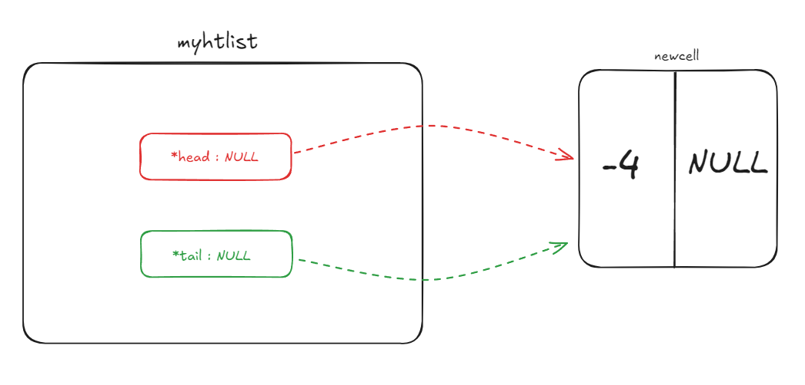

# TD 2 - Listes Avancées

## Rappels

On rappelle la structure utilisée pour les listes de ce TP : 

```C
typedef struct s_ht_list{
    t_cell *head;
    t_cell *tail;
}
```

## Exercice 1 

### Q1 : Vérification liste vide
Il faut que ``head`` et `tail` soient vides

### Q2 : Schématisation



### Q3 : Faire l'algorithme qui fait cet ajout

```C
void main(){
    
}
```