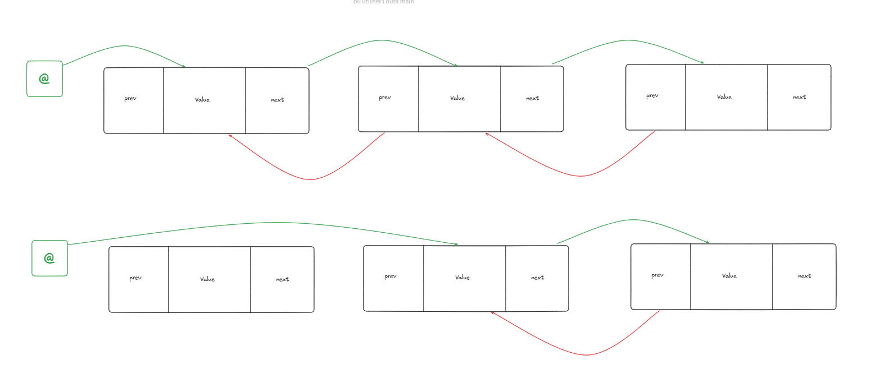

# TD 2 - Listes Avancées

## Rappels

On rappelle la structure utilisée pour les listes de ce TP : 

```C
typedef struct s_ht_list{
    t_cell *head;
    t_cell *tail;
}
```

## Exercice 1 

### Q1 : Vérification liste vide
Il faut que ``head`` et `tail` soient vides

### Q2 : Schématisation


### Q3 : Faire l'algorithme qui fait cet ajout

```C
void main(){
    t_ht_list* myhtlist = createHtList();
    t_cell* newCell = createCell();
    newCell->value = -4;
    myhtlist->head = newCell;
    myhtlist->tail = newCell;
}
```

### Q4 : Ajout en tête

```c
void fonction4(t_ht_list* myList) {
    t_cell* newCell = createCell();
    newCell->value = 123;
    newCell->next = myList->head;
    myList->head = newCell;
}
```

### Q8 : Ajout en queue

```c
void fonction8(t_ht_list* myList) {
    t_cell* newCell = createCell();
    newCell->value = 7;
    myList->tail->next = newCell;
    myList->tail = newCell;
}
```

### Q10 : Fonction AddTail

```c
void AddTailHt(t_ht_list* myList, int value) {
    t_cell* newCell = createCell();
    newCell->value = value;
    if (myList->head == NULL && myList->tail == NULL){ 
        myList->head = newCell; 
        myList->tail = newcell;
    }else{
        myList->tail = newcell;        
    }
}
```

---

## Exercice 2 : Suppression d'une cellule

### Q1 : 
La valeur n'est pas dans la liste si `curr` fini  à `NULL`

### Q2a : 
Il s'agit de la première cellule si `list->head = curr`, il faut donc modifier le `head`

### Q2b : 
Si `list->head = list->tail`, il faut alors mettre `head` et `tail` à ``NULL``

### Q3a : 
Logique

### Q3b
On met le next du prev qui pointe sur le next de curr, puis on free cur

### Q3c : 

Il faut modifier la tail pour la mettre sur prev


---

## Exercice 3 

---
# Listes Circulaires

```c
typedef struct circ_list_t{
    t_cell* head; 
    t_cell* tail;
}
```


## Exercice 4 

Dans une liste circulaire vide, 

Lors de l'ajout d'une cellule en tête, il faut changer `head` et `tail` sur cette nouvelle cellule, sinon il faut juste mettre a jour `cell->next = head` et `head = cell`

---

## Exercice 5

#### Q1 : 

Une liste circulaire est vide si `head` et `tail` sont à `NULL`

#### Q2 :

```c
void displayCircList(t_circ_list clist) {
    if (clist->head != NULL && clist->tail != NULL) {
        t_cell* currCell = clist->head;
        while (currCell != clist->tail) {
            printf("%d ", currCell->value);
            currCell = currCell->next;
        }
        printf("%d ", currCell->value);
    }
}
```

#### Q3 : 

On écrirait `while(currCell != clist->head)`, sauf que `temp = clist->head` donc on ne rentre pas dans la boucle

---

## Exercice 6 :

#### Q1 : 

On donne l'adresse de la liste car on va la modifier

#### Q2 : 

`Head` et `tail` doivent être à `NULL`

#### Q3 : 

```c

void removeCircValue(t_circ_list *clist, int val) {
    if (clist->head != NULL && clist->tail != NULL) {
        if (clist->head == clist->tail) {
            free(clist->head);
            clist->head = NULL;
            clist->tail = NULL;
        }else {
            t_cell* curr = clist->head;
            t_cell* prev = curr;

            while (curr != clist->tail && curr->value != val) {
                prev = curr;
                curr = curr->next;
            }

            if (curr != clist->tail) {
                if (curr == clist->head) {
                    clist->head = curr->next;
                    clist->tail->next = clist->head;
                }else {
                    prev->next = curr->next;
                }
            }else{
                prev->next = clist->head;
                clist->tail = prev;
            }
        }
    }
}
```

---

# Listes doublement chainées

```c

typedef struct t_cellD{
    t_cellD* prev; 
    int value; 
    t_cellD* next;
}

typedef struct{
    t_cellD* head;
}t_listD;
```

## Exercice 1 : 


```c
void addDoubleHead(int value, t_listD* list){
    t_cellD* newCell = createDCell(value);
    if (list->head == NULL){
        list->head = newCell;
    }else{
        newCell->next = list->head; 
        list->head = newCell;
    }
}
```

---

## Exercice 2 :



